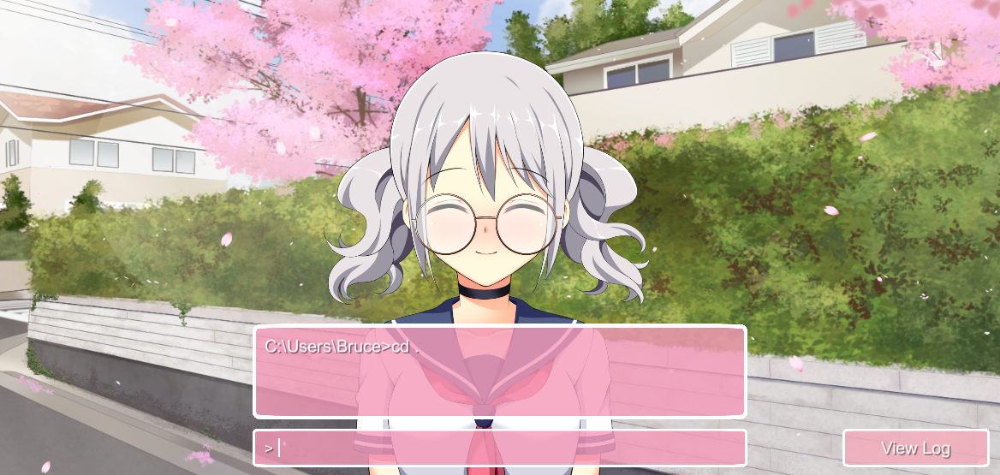

# Visual Novel Terminal

A reskin for the terminal that makes it look like a visual novel.

## Quick Start

1. Clone this repository.
2. Unzip the `.zip` file corresponding to your system's OS in the [`Dist`](./Dist/) directory.

## Configuration

Visual Novel Terminal allows user to customize and configure their terminal experience. In the directory housing your executable data, create a `config.json` file if it doesn't already exist. Modify the value of the following feels to fit your needs.

| Field 	| Type 	| Description 	| Default 	|
|---	|---	|---	|---	|
| `repeatRate` 	| float 	| The amount of time between each character appearing in seconds. Controls the scroll speed.  	| 0.01 	|
| `primaryColor` 	| RGBA hex string 	| The color of the text backgrounds. 	| #F59AB8CE 	|
| `secondaryColor` 	| RGBA hex string 	| The color of the borders. 	| #FFFFFFFF 	|
| `standardOutputColor` 	| RGBA hex string 	| The color of the text when the terminal sends to the standard output stream. 	| #FFFFFFFF 	|
| `standardErrorColor` 	| RGBA hex string 	| The color of the text when the terminal sends to the standard error stream. 	| #D6251DFF 	|
| `standardOutputCharacterSprites` 	| array of absolute file paths 	| The paths to the character sprites displayed whenever the terminal sends to the standard output stream. 	| [] (default sprites used) 	|
| `standardErrorCharacterSprites` 	| array of absolute file paths 	| The paths to the character sprites displayed whenever the terminal sends to the standard error stream. 	| [] (default sprites used) 	|
| `canvasBackgroundSprite` 	| absolute file path 	| The path to the background image. 	| "" (default sprite used) 	|
| `workingDirectory` 	| absolute file path 	| The directory that the terminal starts in. 	| Windows: %USERPROFILE% OSX: $HOME Linux: $HOME 	|
| `shellFilePath` 	| absolute file path 	| The directory of the shell program. 	| Windows: %COMSPEC% OSX: $SHELL Linux: $SHELL 	|

## Screenshots

## Credits

Default backgrounds created by [Noraneko Games](https://noranekogames.itch.io/yumebackground).

Default character models created by [Sutemo](https://sutemo.itch.io/female-character).

American Psycho Apartment render created by [Alex Patej](https://www.artstation.com/artwork/w64NkO).
